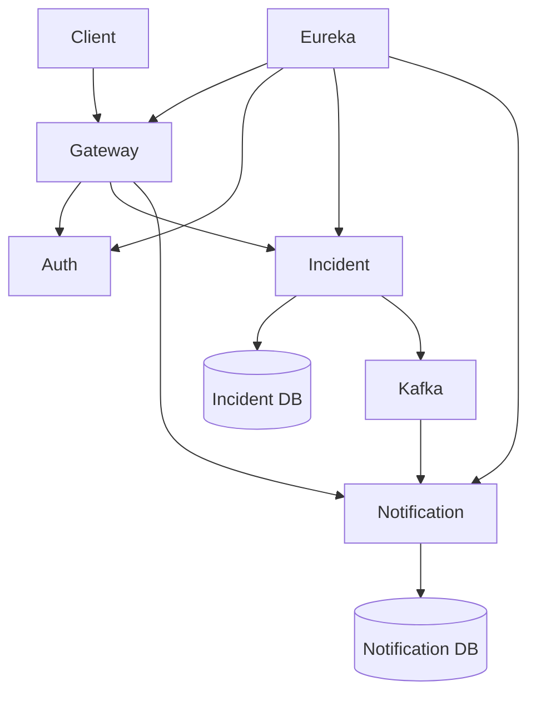
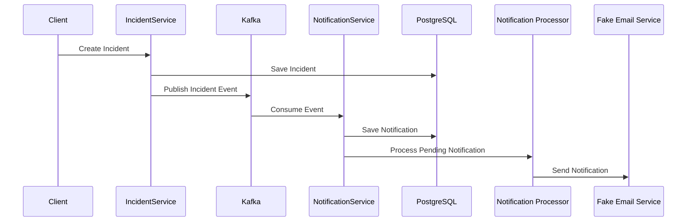

<div align="center">

# Incident Management Platform

A microservices-based Incident Management Platform built using **Java**, **Spring Boot**, **Spring Cloud**, **Apache Kafka**, and **PostgreSQL**.

This project is being developed to learn production-level backend development concepts such as Microservices, Event-Driven Architecture, Distributed Systems, Caching, Resilience Patterns, Docker, Kubernetes, and CI/CD.

</div>

---

# Tech Stack

## Backend

- Java 21
- Spring Boot 3
- Spring Security
- Spring Data JPA
- Spring Validation

## Microservices

- Spring Cloud Gateway
- Eureka Service Discovery

## Database

- PostgreSQL

## Messaging

- Apache Kafka

## Authentication

- JWT Authentication

## Build Tool

- Maven

## Version Control

- Git
- GitHub

---

# Microservices

| Service | Description |
|----------|-------------|
| API Gateway | Routes all incoming requests |
| Eureka Server | Service Discovery |
| Auth Service | JWT Authentication |
| Incident Service | Incident Management |
| Notification Service | Kafka Consumer & Notification Processing |

---

# Current Architecture



---

# Event Flow



---

# Features Implemented

## API Gateway

- Centralized Routing
- Service Discovery Integration

## Eureka Server

- Dynamic Service Registration
- Service Discovery

## Authentication Service

- User Registration
- User Login
- JWT Authentication
- Password Encryption

## Incident Service

- Create Incident
- Update Incident
- Resolve Incident
- Close Incident
- Reopen Incident
- Pagination
- DTO Mapping
- Validation
- Global Exception Handling
- Kafka Producer

## Notification Service

- Kafka Consumer
- Event Processing
- Notification Persistence
- Background Scheduler
- Fake Email Simulation
- Notification APIs
- Notification Status Tracking

---

# Kafka Workflow

```text
Incident Created

        │

        ▼

Kafka Topic

incident-events

        │

        ▼

Notification Service

        │

        ▼

Notification Saved

        │

        ▼

Notification Processor

        │

        ▼

Fake Email Service
```

---

# Database

### Incident Service

- Incidents

### Notification Service

- Notifications

---

# What I Learned

## Spring Boot

- Layered Architecture
- DTO
- Mapper
- Validation
- Exception Handling

## Spring Security

- JWT Authentication
- Password Encryption

## Spring Cloud

- API Gateway
- Eureka Service Discovery

## Apache Kafka

- Producer
- Consumer
- Event-Driven Architecture
- Asynchronous Communication

## Notification Processing

- Background Scheduler
- Notification Lifecycle
- Event Processing

## Database

- Spring Data JPA
- Relationships
- Pagination

---

# Project Structure

```text
Incident-Management-Platform

├── api-gateway
├── auth-service
├── eureka-server
├── incident-service
├── notification-service
└── docker
```

---

# APIs

## Auth Service

- Register User
- Login User

## Incident Service

- Create Incident
- Update Incident
- Resolve Incident
- Close Incident
- Reopen Incident
- Get Incident
- Get All Incidents

## Notification Service

- Get Notification
- Get All Notifications

---

# Features Planned

- Role Based Access Control (RBAC)
- Retry Mechanism
- Dead Letter Queue (DLQ)
- Redis Caching
- Circuit Breaker (Resilience4j)
- Rate Limiting
- Docker
- Kubernetes
- GitHub Actions CI/CD
- Prometheus
- Grafana
- Production Deployment

---

# Running the Project

## Clone Repository

```bash
git clone <repository-url>
```

## Start Infrastructure

- PostgreSQL
- Kafka
- Eureka Server

## Run Services

1. Eureka Server
2. API Gateway
3. Auth Service
4. Incident Service
5. Notification Service

---

# Current Status

- Core Microservices Architecture Completed
- Event-Driven Communication Completed
- Authentication Completed
- Notification Workflow Completed

The remaining work focuses on production-level backend engineering concepts such as resilience, caching, DevOps, monitoring, and deployment.

---

# Author

**Maksud Rahman**

Backend Developer | Java | Spring Boot | Microservices
