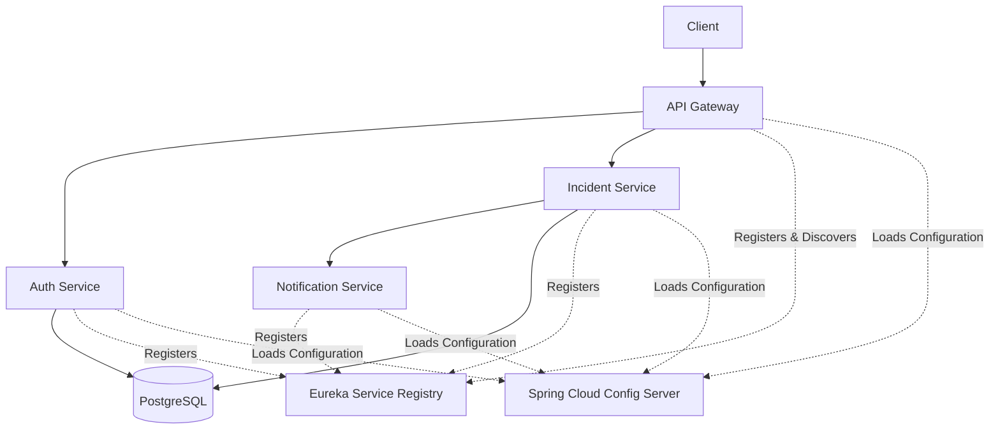
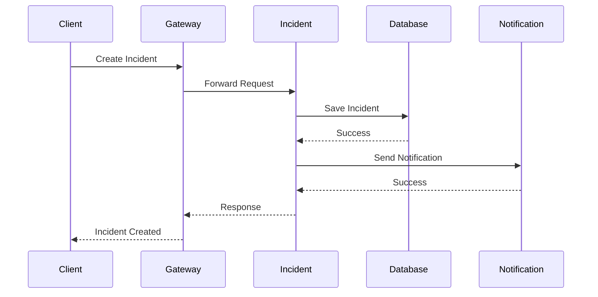
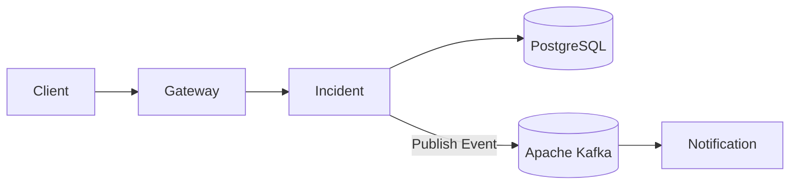

# Incident Management Platform

A backend project built using Spring Boot Microservices to learn how modern distributed systems are designed and developed.

The project is inspired by real-world incident management platforms used by software teams to track, assign, and resolve operational incidents. The main objective of this project is to gain hands-on experience with microservices, Spring Cloud, and production-oriented backend concepts.

> **Project Status:** In Progress

---

# Overview

This project simulates an incident management system where users can create, update, assign, and resolve incidents.

Instead of building a simple CRUD application, the goal is to understand how multiple services communicate with each other and how components like API Gateway, Service Discovery, Config Server, and Fault Tolerance are used in a distributed system.

As the project progresses, more production-grade features such as event-driven communication, caching, Docker, testing, monitoring, and CI/CD will be added.

---

# Current Architecture



---

# Request Flow



---

# Planned Event Flow

The Notification Service currently communicates directly with the Incident Service.

In the next phase, this will be replaced with Apache Kafka to achieve asynchronous communication.



---

# Features Implemented

## Authentication

- User Registration
- User Login
- Password Encryption
- Spring Security configuration

---

## Incident Management

- Create Incident
- View Incident
- Update Incident
- Assign Incident
- Resolve Incident
- Incident Status Management

### Incident Status

- OPEN
- IN_PROGRESS
- RESOLVED
- CLOSED
- REOPEN

### Priority Levels

- P0
- P1
- P2
- P3
- P4

---

## Notification Service

- Separate Notification Microservice
- Notification endpoint integration with Incident Service
- Microservice-to-microservice communication

---

## Spring Cloud

- API Gateway
- Eureka Service Registry
- Spring Cloud Config Server
- OpenFeign Client
- Centralized Configuration
- Service Discovery

---

## Fault Tolerance

Implemented using Resilience4j

- Circuit Breaker
- Retry Mechanism

---

# Project Structure

```
incident-management-platform

│── api-gateway
│── eureka-server
│── config-server
│
│── auth-service
│── incident-service
│── notification-service
│
└── README.md
```

---

# Technology Stack

### Backend

- Java
- Spring Boot
- Spring MVC
- Spring Data JPA
- Hibernate

### Microservices

- Spring Cloud Gateway
- Eureka Server
- Spring Cloud Config Server
- OpenFeign
- Resilience4j

### Database

- PostgreSQL

### Security

- Spring Security
- JWT

### Build Tool

- Maven

---

# Learning Objectives

This project is part of my backend learning journey.

Through this project I am learning:

- Microservices Architecture
- Service Discovery
- API Gateway
- Distributed Configuration
- REST API Design
- Inter-Service Communication
- Fault Tolerance
- Spring Security
- Backend System Design

---

# Planned Features

The following features will be implemented as I continue learning backend development.

- JWT Authentication
- Role-Based Access Control (RBAC)
- Apache Kafka
- Event-Driven Architecture
- Redis Caching
- Docker & Docker Compose
- Unit Testing
- Integration Testing
- GitHub Actions
- Monitoring using Spring Boot Actuator
- Prometheus & Grafana
- Email Notifications
- Audit Logs
- Dashboard & Analytics
- Automatic Incident Detection

---

# Future Improvements

Some improvements planned for future versions include:

- Replace synchronous service communication with Kafka
- Cache frequently used data using Redis
- Dockerize all microservices
- Add CI/CD pipeline using GitHub Actions
- Add monitoring and health checks
- Deploy the project to cloud
- Improve testing and code coverage

---

# Author

Maksud Rahman

GitHub: https://github.com/iRahmanG

---

# Note

This project is still under active development. New features and improvements will continue to be added as I learn more about backend development and microservices.
